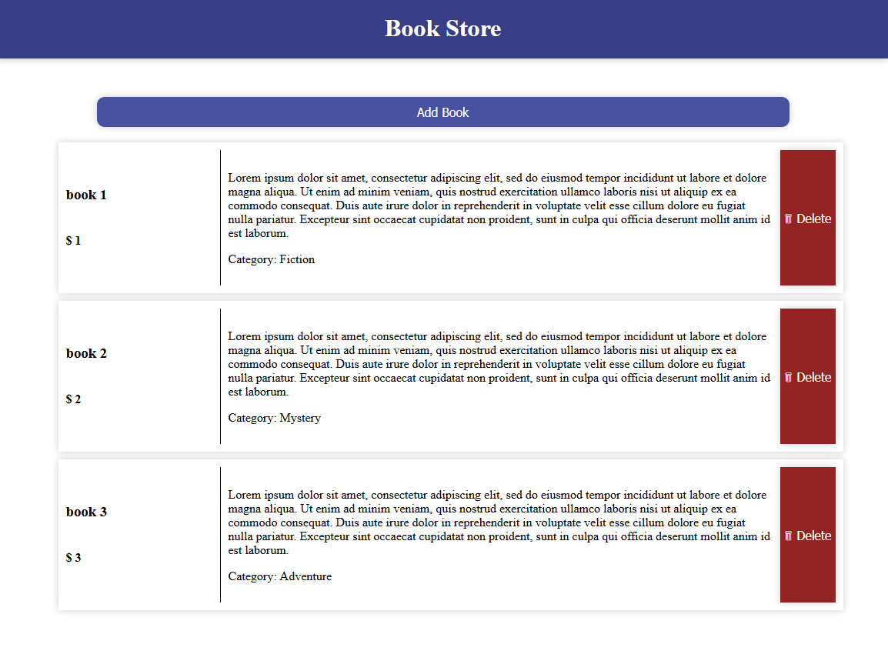

# BookStore

Install packages
``` bash
npm install
```

To run locally
``` bash
npm run dev
```

To preview production build locally
``` bash
npm run build

npm run preview
```

Open `http://localhost:5173`

or

Set the environment variable `PORT` and open `http://localhost:<PORT>`


### Screenshots



